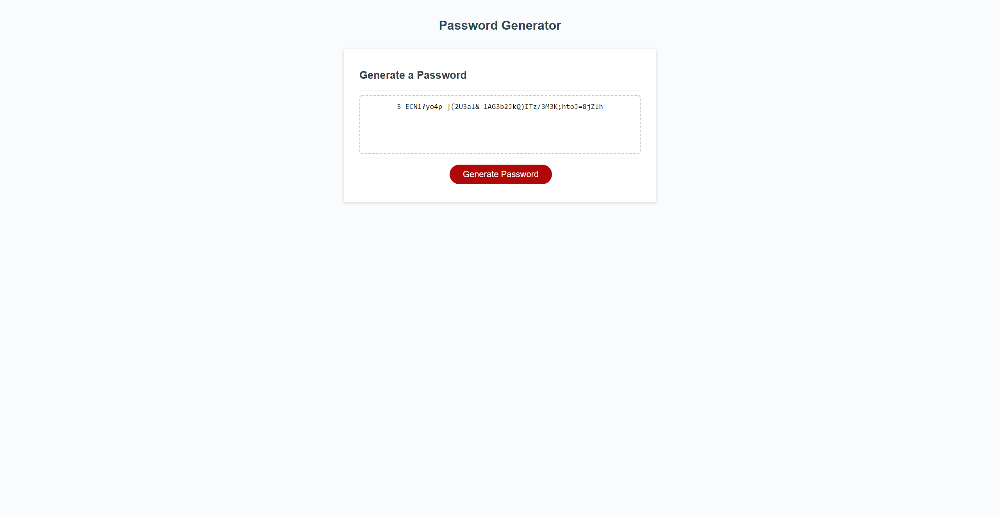

# Tulip

## Website

https://calebfunderburk.github.io/Tulip/

## Built With

- HTML
- CSS
- JavaScript

## Project Narrative

### About

In this project I was tasked with creating the functionality for a Password Generator website. All of the work I did is within the js file here in the repo. It started with me creating a function called generatePassword that was being called in the writePassword function. I started by setting up the initial prompt window and the confirm windows that follow. My first goal was to be able to pilot through the user experience and setup validation for the criteria needed to generate a password. During this step, I also needed to turn the string provided by the user in the prompt window into an integer. After that, my next step was create arrays that the confirm windows would interact with, and push information into another array if selected. Next, I had some fun with the Math object in JavaScript. I had to create a couple of functions to handle the random characters that would be selected for the password, and a random order to put them in. Lastly, I returned the function to have the password display on the page. This project was a lot of fun and I definitely learned a lot!

## Screenshot

